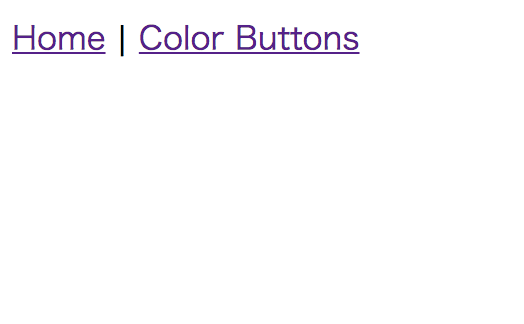
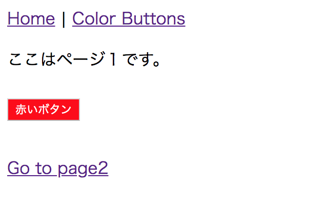

# simple-vue-router
LEMP環境(DBは入れただけで未使用。。)でvue.jsのpageコンポーネント(Atomic Design)をvue-routerでルーティングするシンプルなサンプルです。
### 環境設定
Linux(ubuntu18.04 LTS)の例となります
yumやHomebrewでも docker, docker-compose, node.js, npm の４つが正常起動すれば問題ありません。

必要最低限のモジュールと、docker, docker-composeのインストーラーを用意しました。
```
sh ./apt-install.sh
```
続いてnode.jsとnpmをインストールします。
```
apt install nodejs-dev node-gyp libssl1.0-dev
apt install npm
```
続いてnode_modulesをインストールします。
```
cd ./app
npm install --no-bin-links
```
node_modulesディレクトリ配下に、package.jsonの dependencies devDependencies のパッケージが作成されます。

`--no-bin-links` にしている理由は、VM(仮想環境)のホスト、ゲスト間のマウントとシンボリックリンクの相性が良くないためです。
VMを使用していない場合は必要ないかと思います。
### 起動
docker-compose.ymlがあるディレクトリに戻ってdocker-composeでコンテナを立ち上げます
docker-compose.ymlのnginxのportは、`80`としています。環境に合わせて変更して頂いても構いません
```
cd ../
docker-compose up -d
```
### 確認
`<domain>/`へアクセスしてください。domainは各々の環境依存となってしまいますが、macやwindowsに直接dockerコンテナを立ち上げて
特に何も設定変更していない場合は、`localhost`で問題ないのではないでしょうか？
ちなみに私は、VMのDHCPの設定上`localhost`では動きませんのであしからず。。
  
上記のように表示されてばOKです。`Color Button`のリンクをクリックします
  
上記のように表示されてばOKです。ここで重要なのが、リンクを押下しても画面はリダイレクトされず、pageコンポーネントのみが入れ替わっています。
また、リダイレクトされていないのにも関わらず、ブラウザの戻るボタンは作動します。
これは、vue.jsのプラグインのvue-routerによるもので、Atomic DesignでWEBアプリケーションを構築する際に非常に強力なプラグインとなります。
vue-routerとAtomic Designのpageコンポーネントの組み合わせで、良い意味で強制的ににSingle Page Application(SPA)となります。
### ビルド
vueファイルを変更した場合`./app`へ移動してビルドしてください。
ビルドコマンンドの設定は、package.jsonの`scripts`に記述しています。ご参考まで。
```
cd ./app
npm run build
```
毎回ビルドするのは面倒ですし、非常に時間がかかります。watcherで差分実行することを強くお勧めいたします。
```
npm run watch
```
最初は、VMでのホスト、ゲスト間のマウントをしているとファイルの更新を察知してくれませんでした。
watchの設定で`poll`を設定してあげるとうまくいきました。`./app/webpack.config.js`の`watchOptions`に設定済みです。

vueファイルを変更が一通り終わったら、`npm run build`でフルコンパイルしてください。`./app/dist/js/bundle.js`のファイルサイズが 1/4 程になり
動作も高速化されます。


